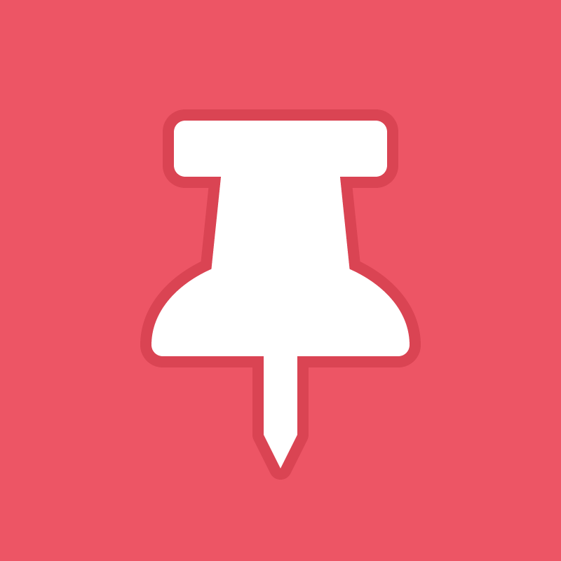
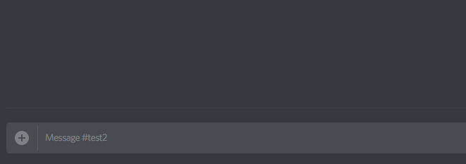

#  Pin It

## Let the community vote on pinning messages

Pins can get a bit stale, let users just add 📌 reaction to messages they like and once the threshold is met it is pinned.

Invite the bot with the ability to manage messages (remove reactions if someone tries to pin their own message), and add reactions: `https://discordapp.com/api/oauth2/authorize?client_id=<YOUR_CLIENT_ID>&permissions=8256&scope=bot`

 

## There are only 3 commands

*Must have Manage Messages permission to use.*

- `:pushpin: x %n` where `%n` is the number of pin reactions needed to be pinned. Whitespace is ignored.
- `:pushpin: :thumbsdown:` to disable reactions pinning messages in the channel it is used in, the command is deleted 5 seconds later automatically. Any 📌 reactions in a disabled channel will be deleted when used.
- `:pushpin: :thumbsup:` to re-enable reactions pinning messages in the channel it is used in.

